# Application contrôleur DCS5

Cette application python (python 3.10) fournit une interface graphique pour interagir
(GUI) avec une carte de mesure BigFin Dcs5 XT ou MICRO via Bluetooth.
L'application transforme les entrées du stylet sur la carte de mesure en entrée au clavier,
transformer essentiellement la carte de mesure dcs5 en un clavier sans fil.
Une balance marine Marel peut également être connectée à l'application.
Voir le projet[marel_marine_scale_controller](https://github.com/iml-gddaiss/marel_marine_scale_controller)pour plus d'informations et comment configurer la balance.

# Télécharger à partir des versions

Téléchargement de l'application Dcs5 Controller à partir de la dernière version.

1.  Télécharger`dcs5.zip`de la dernière version ici:<https://github.com/iml-gddaiss/dcs5/releases>.
2.  Décompresser`dcs5.zip`
3.  Courir`dcs5.exe`

## Configuration requise pour installer le package python. (Non requis pour utiliser l'application en tant qu'application autonome.)

-   Python 3.10

# Usage

### Guide d'utilisation en français pour le modèle XT :[UserGuide_fr.pdf](doc/UserGuide_fr.pdf).

## Planche à mesurer

#### Zone de détection du stylet

Le stylet doit être placé dans la zone de détection.
Le délai de détection est réglable dans la configuration (Voir section[Fichiers de configuration](#configurations-files)).
Les voyants du boîtier de commande clignotent lorsqu'une mesure est effectuée.

<p style="text-align: center;">
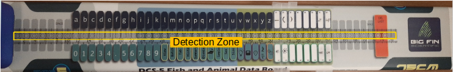
</p>

#### Modes de sortie

La carte de mesure dispose de 3 modes de sortie différents ;**longueur**,**haut**et**bas**.
Le**haut**et**bas**mode sont utilisés
pour accéder aux touches du haut et du bas
en plaçant le stylet sur le cercle correspondant à l'intérieur de la zone de détection de la carte.
Il y a 2 manières de changer la zone de détection ;
en mappant les commandes sur les touches du boîtier de commande ou en définissant des régions de balayage sur le tableau.

La commande map pour passer à un mode de sortie spécifique ou pour parcourir les modes de sortie.

-   Voir section[Fichiers de configuration](#configurations-files)pour les commandes de mode de sortie.

De plus, l'affichage LED par défaut du boîtier de commande change en fonction des modes de sortie.

-   Voir section[Affichages LED](#leds-displays).

##### Balayer la région

Commencer de gauche à droite dans une zone de balayage changera le mode de sortie.
Les régions de balayage sont définies dans les fichiers de configuration.
Par exemple, voici les régions de balayage par défaut pour le`xt`boîtier de commande.

<p style="text-align: center;">
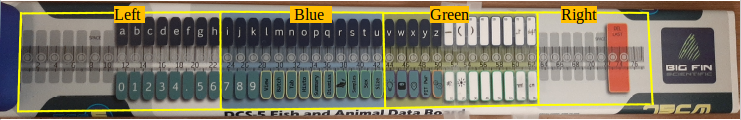
</p>
The corresponding output modes are:

-   Gauche droite :**Longueur**
-   Bleu :**Haut**
-   Vert:**Bas**

La définition de la carte dans le fichier de configuration est :

```json
  {"output_modes": {
      "segments_limits": [0, 230, 430, 630, 800],
      "segments_mode": ["length", "top", "bottom", "length"]
      }}
```

-   Voir section[Spécification de l'appareil](#device-specification)pour plus d'informations sur la définition de la zone de balayage.

#### Exemple de mesure

Les mesures sont effectuées en plaçant la tête du stylet à plat sur la carte dans la zone de détection.
Vous pouvez modifier les paramètres de mesure/détection dans[configuration du contrôleur](#controller-configuration).

<p style="text-align: center;">
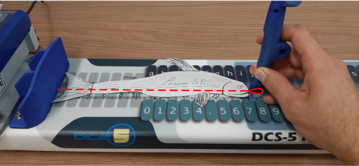
</p>

## Boîtier de commande

La seule différence entre le`xt`et`micro`Les modèles de boîtier de commande sont le nombre de touches et l'affichage LED et la séquence de clignotement.

### Modèle:`xt`

-   32 touches

<p style="text-align: center;">
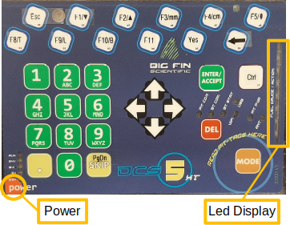
</p>

### Modèle:`miro`

-   3 clés

<p style="text-align: center;">
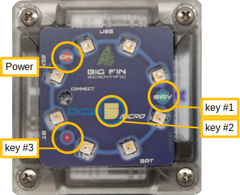
</p>

### Affichages LED

Différents modèles de LED sont affichés sur le boîtier de commande pour donner un retour aux utilisateurs.

-   xt : JAUGE DE CARBURANT / ACTION barre led
-   micro : Anneau LED

#### Mode de sortie

Le modèle par défaut affiche le mode de sortie actuel.

<p style="text-align: center;">
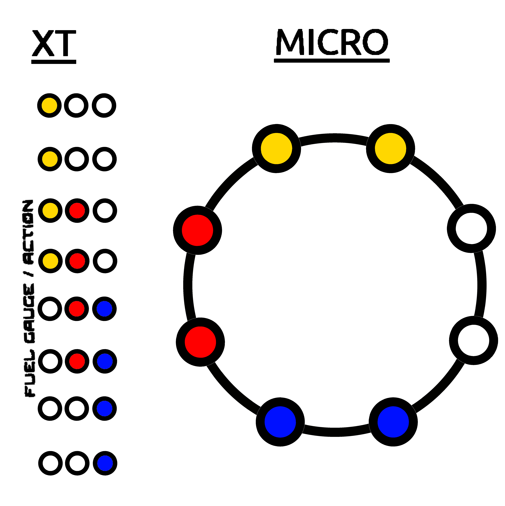
</p>

-   T : Haut
-   L : Longueur
-   B : Bas

#### Détection du stylet

Le motif de led de suivi s'affiche lorsque la carte détecte le stylet.

<p style="text-align: center;">
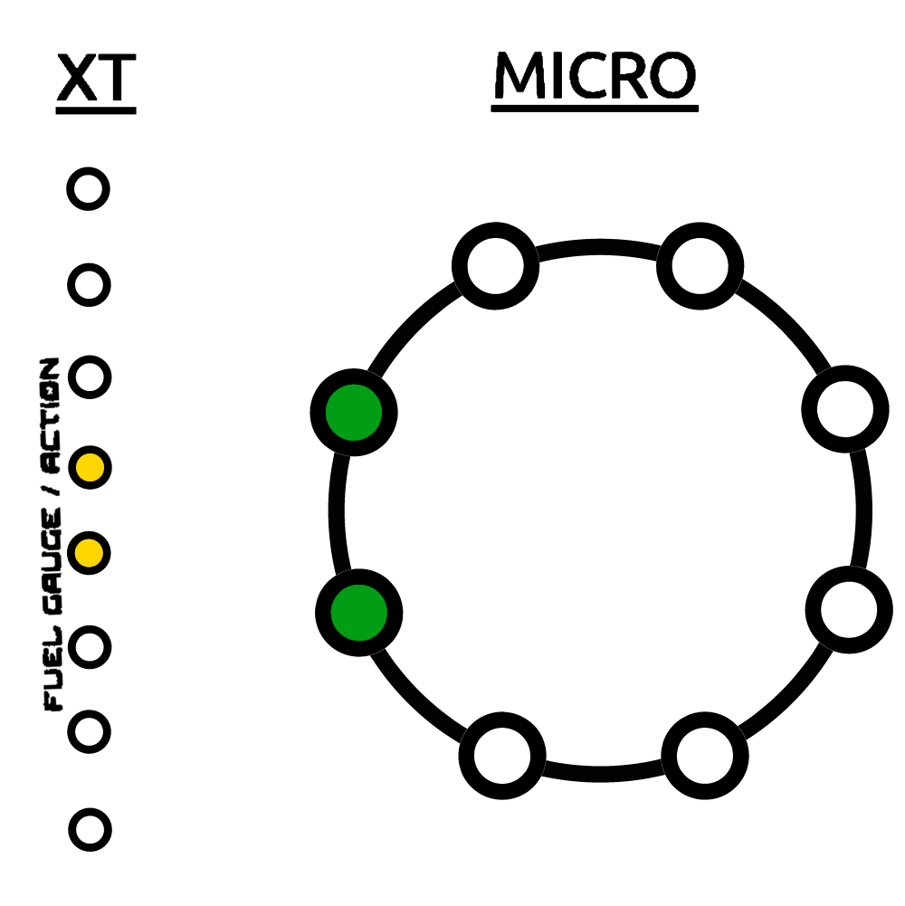
</p>
 
#### Measurements
All the leds flash rapidly when a measurement is made.
The default pattern displays the current output mode.
<p style="text-align: center;">
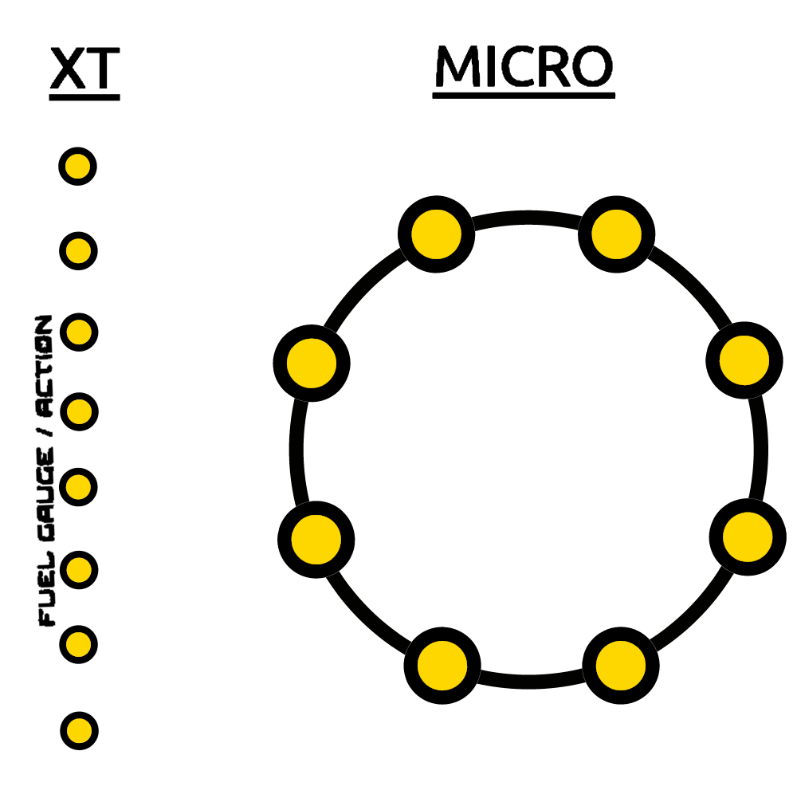
</p>

#### Glisser

<p style="text-align: center;">
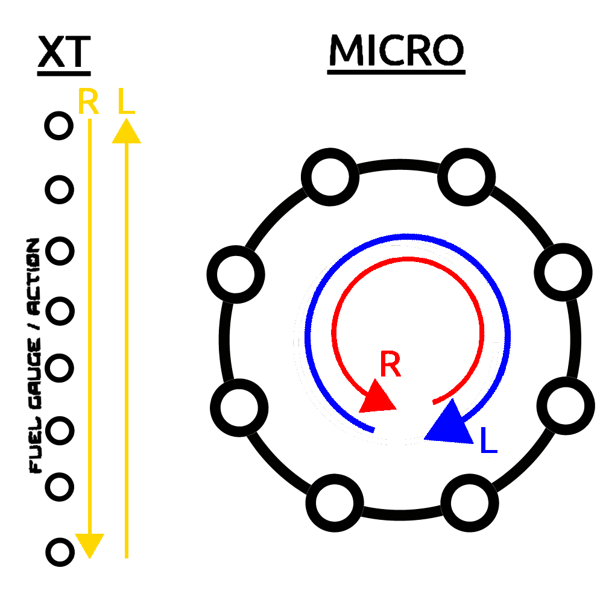
</p>

-   L : balayage de droite à gauche
-   R : Balayage de gauche à droite

#### Étalonnage

En mode d'étalonnage, l'affichage par défaut passe à

<p style="text-align: center;">
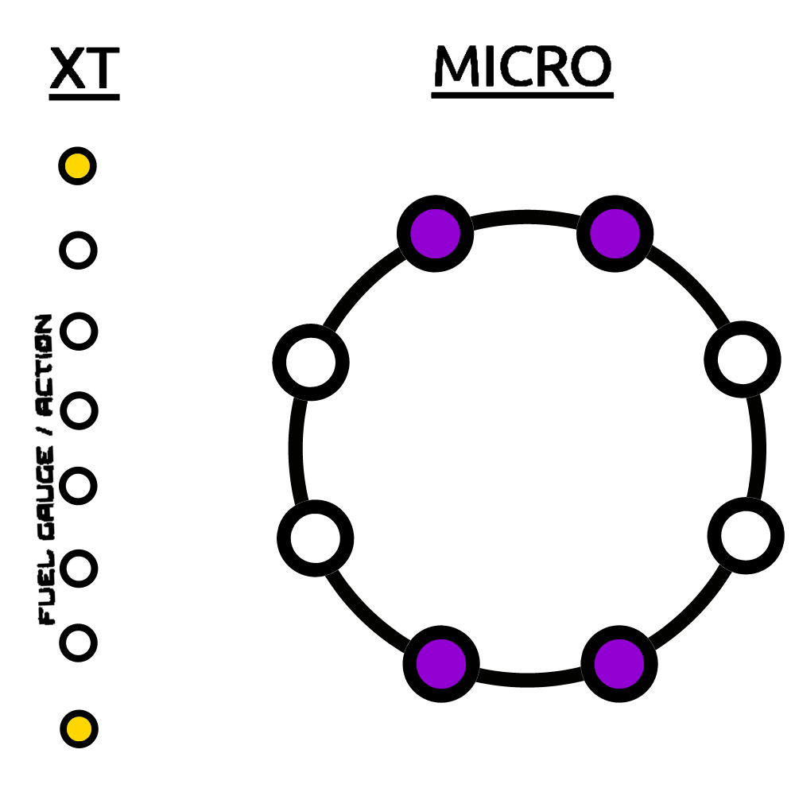
</p>

Ensuite, une fois le stylet posé, les leds s'allumeront lentement dans les séquences suivantes.
Lorsque le point est calibré avec succès, toutes les leds clignotent rapidement.

<p style="text-align: center;">
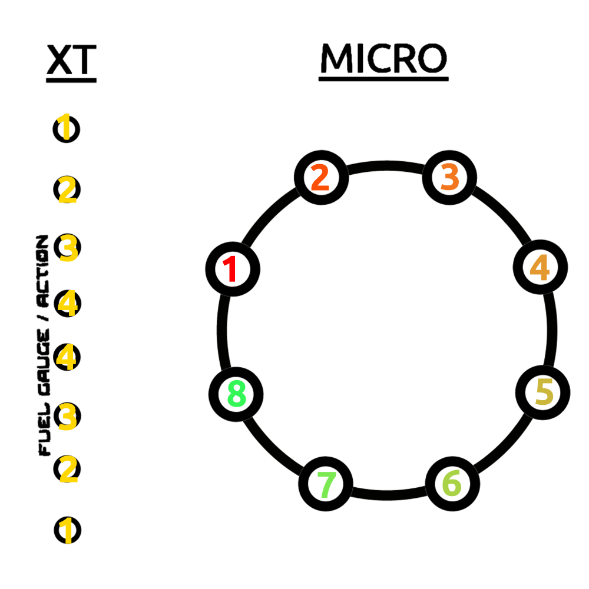
</p>

## Application

### Configurations

L'application nécessite une configuration pour fonctionner.
Pour charger et gérer la configuration, cliquez sur**Dcs5 > Paramétrage**dans la barre supérieure.

<p style="text-align: center;">
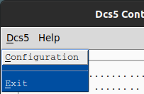
</p>

Du_Configuration_fenêtre, vous pouvez créer**Nouveau**,**Charger**,**Supprimer**et**Modifier**configurations.

<p style="text-align: center;">
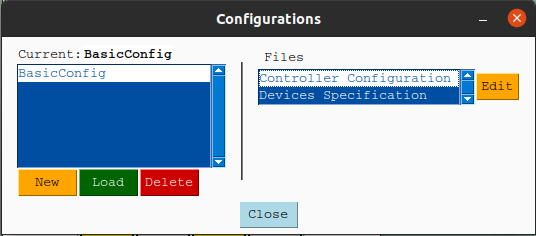
</p>

#### Nouvelle configuration

Des configurations par défaut sont fournies pour le`xt`et`micro`des modèles.
Sélectionnez le modèle de boîtier de commande (xt ou micro) et entrez un nom pour la nouvelle configuration.

<p style="text-align: center;">
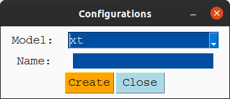
</p>

L'adresse Bluetooth du contrôleur (adresse MAC) devra être changée une fois qu'une nouvelle configuration est créée.
Sélectionnez la configuration et le`Controller Configuration`déposer et appuyer**Modifier**.
Dans le fichier json, modifiez la valeur suivante :

-   `client -> mac_address`

Voir section[Fichiers de configuration](#configurations-files)pour plus d'informations sur les différents paramètres de configuration.

### Connectez la carte via Bluetooth

Pour se connecter à la carte de mesure Dcs5, l'adresse Board Mac (bluetooth) doit être spécifiée dans le_Configuration du contrôleur_déposer. Vous pouvez modifier le fichier via le menu de configuration (voir les sections[Configurations](#configurations)et[Configuration du contrôleur](#controller-configuration))

Ensuite, vous devez vous connecter puis activer la carte en appuyant sur le**Connecter**et**Activer**bouton.

<p style="text-align: center;">

</p>

Le cercle rouge à côté du**Connecter**le bouton se transformera en triangle jaune
pendant que l'application tente de se connecter à la carte, puis dans un vert lorsqu'elle est connectée.

<p style="text-align: center;">
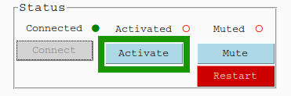
</p>

Les cercles rouges à côté du**Activer**Le bouton deviendra également vert lorsque l'application et la carte seront prêtes à être utilisées.
Lors de l'activation de la carte, l'application se synchronisera avec le boîtier de commande de la carte.
(Voir la rubrique[Fonctionnalités supplémentaires de l'interface graphique](#additional-information)).
L'application essaiera de se synchroniser avec le boîtier de commande de la carte lors de l'activation.
L'application et la carte sont synchronisées
lorsque l'application reçoit des confirmations que les paramètres internes de la carte
(principalement ceux liés à la détection du stylet) sont les mêmes que ceux spécifiés dans les fichiers de configuration.
Si la synchronisation a échoué, indiqué par un cercle rouge à côté du**Synchroniser**bouton,
vous pouvez appuyer sur le**Synchroniser**bouton pour réessayer.
Si cela ne fonctionne toujours pas, essayez de redémarrer la carte et l'application.

### Étalonnage

La carte doit être calibrée à l'aide de deux points de calibrage.
Bien que l'étalonnage soit linéaire, gardez à l'esprit que le stylet a une épaisseur non uniforme qui compensera,
dans une certaine mesure, les valeurs mesurées si l'orientation du stylet diffère lors de la mesure par rapport à l'étalonnage.
Nous vous recommandons d'utiliser la plus petite partie du stylet pour effectuer le calibrage
puis ajouter`offset`dans les fichiers d'étalonnage de chaque stylet.

-   Voir section[Spécification de l'appareil](#device-specification).

Pour calibrer la carte, cliquez sur**Réglez Cal. Pts.**

<p style="text-align: center;">
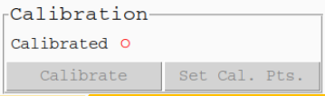
</p>

Dans la fenêtre des points d'étalonnage, définissez les deux points d'étalonnage en mm.

<p style="text-align: center;">
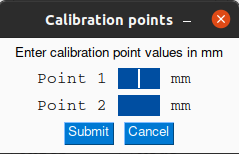
</p>

appuie sur le**Étalonner**bouton pour entrer dans le mode de calibrage,
à partir de là, suivez les instructions données par l'application.
Notez qu'un balayage de droite à gauche permet de quitter le mode d'étalonnage.
Pour chaque point d'étalonnage,
la progression de l'étalonnage sera indiquée par les LED suivantes[afficher](#calibration)une fois le stylet posé.
Si le stylet est trop levé ou déplacé avant que le calibrage ne soit terminé, le calibrage redémarre.

### Informations Complémentaires.

#### Onglet DCS5

<p style="text-align: center;">
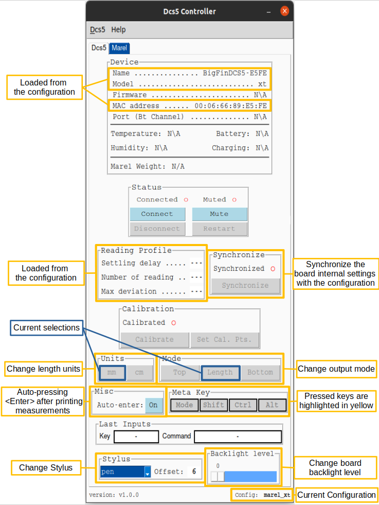
</p>

#### Onglet Échelle Marel

<p style="text-align: center;">
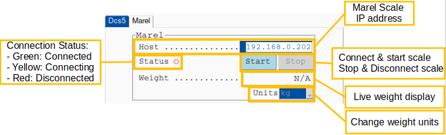
</p>

## Fichiers de configuration

Les configurations sont créées et modifiées via l'interface graphique de l'application (voir la section[configuration](#configurations)).
Une configuration est composée de deux fichiers json qui sont utilisés pour modifier le comportement du contrôleur et de la carte de mesure.

-   [configuration du contrôleur](#controller-configuration)
-   [device_specification](#device-specification)

### Configuration du contrôleur

Défaut`xt`déposer:[xt_controller_configuration.json](dcs5/default_configs/xt_controller_configuration.json)

Défaut`micro`déposer:[micro_controller_configuration.json](dcs5/default_configs/micro_controller_configuration.json)

Usage:

-   client : Informations Bluetooth sur la carte de mesure.
    ```json
      {"client": {
          "device_name": "BigFinDCS5-E5FE",
          "mac_address": "00:06:66:89:E5:FE",
          "marel_ip_address": "192.168.0.202"
      }}
    ```
    -   device_name : nom de l'appareil. (Seulement utilisé pour afficher dans l'application.)
    -   mac_address : adresse Bluetooth (mac) de la carte de mesure, c'est-à-dire**00:06 : I : coupe : frère : dans**.
    -   marel_ip_address: Ip address of the Marel Scale (see [marel_marine_scale_controller](https://github.com/iml-gddaiss/marel_marine_scale_controller)).
-   launch_settings : paramètre utilisé au lancement de l'application.
    ```json
          {"launch_settings": {
          "output_mode": "length",
          "reading_profile": "measure",
          "dynamic_stylus_mode": true,
          "backlighting_level": 95,
          "length_units": "mm",
          "stylus": "pen",
          "auto_enter": true
          }}
    ```
    -   output_mode : haut, longueur ou bas.
    -   reading_profile : Nom (clé) du profil. Les profils de lecture sont définis ci-dessous.
    -   dynamic_stylus_mode : (vrai/faux) Si vrai, les profils de lecture changeront pour chaque mode de sortie, comme défini dans la section suivante.
    -   backlight_level : (0-95) Intensité du rétroéclairage
    -   length_units : unités des valeurs de mesure soit**cm**ou**millimètre**
    -   stylet : nom du stylet utilisé. Doit être défini dans le[spécifications_appareils](#device-specification)déposer.
    -   auto_enter : appuyez automatiquement sur la touche_entrer_après l'impression d'une valeur de longueur ou de poids.
-   lecture_profils :
    ```json
      {"reading_profiles": {
          "measure": {
              "settling_delay": 9,
              "number_of_reading": 50,
              "max_deviation": 50
          }}}
    ```
    -   settling_delay : (0-20) Délai après la première détection du stylet. (pas des secondes)
    -   number_of_reading : nombre de lectures nécessaires pour une bonne mesure.
    -   max_deviation : (1-100) Quantité d'écart autorisée entre chaque lecture._Remarques : Pour plus d'informations :[guide_utilisateur/Big-Fin-Scientific-Fish-Board-Integration-Guide-V2_0.pdf](doc/Big-Fin-Scientific-Fish-Board-Integration-Guide-V2_0.pdf)_
-   modes_sortie :
    ```json
      {"output_modes": {
          "swipe_threshold": 5,
          "segments_limits": [0, 230, 430, 630, 800],
          "segments_mode": ["length", "top", "bottom", "length"],
          "mode_reading_profiles": {
              "top": "key",
              "length": "measure",
              "bottom": "key"
          }
    }}
    ```
    -   Seuil de balayage : distance minimale (mm) pour qu'un balayage de stylet soit valide.
    -   segments_limits : définit les limites (mm) des différents segments de balayage.
    -   segments_mode : Le output_mode correspondant pour chaque segment de balayage.
    -   mode_reading_profiles : les profils de lecture correspondants pour chaque mode de sortie.
-   keys_maps (voir[Mappage des clés](#key-mapping)section):
    Des champs:`control_box`,`control_box_mode`,`board`,`board_mode`
    -   A key can be mapped to commands or keyboard inputs.
    -   Une carte peut être une liste de commandes ou d'entrées au clavier qui sont exécutées une par une.
    -   Une touche peut avoir deux mappages : un par défaut et un mappage alternatif (mode).

#### Mappage des clés

Les noms des clés sont définis dans[devices_specification.json](dcs5/default_configs/xt_devices_specification.json).

Commandes :

-   `"BACKLIGHT_UP", "BACKLIGHT_DOWN"`: Modifier le niveau de rétroéclairage du boîtier de commande.
-   `"CHANGE_STYLUS"`: Parcourir la liste des stylets définis dans le[spécifications_appareils](#device-specification)déposer.
-   `"UNITS_mm", "UNITS_cm"`: Modifier les unités de sortie.
-   `"MODE_TOP", "MODE_LENGTH", "MODE_BOTTOM"`: Changez le mode de sortie.
-   `"CHANGE_OUTPUT_MODE"`: Faire défiler le mode de sortie (TOP, LENGTH, BOTTOM).
-   `"MODE"`: Accéder au mappage (mode) alternatif (`control_box_mode`,`board_mode`).
-   `"WEIGHT"`: Imprime le poids mesuré par la balance Marel (si connectée).
-   `"DELETE_LAST`: Supprimer la dernière valeur imprimée.
-   `"PRINT <string to print>"]`: Imprime le`<string to print>`valeur.

    Saisie valide au clavier (Source :[Pya Uto Manger](https://pyautogui.readthedocs.io/en/latest/)):

        ['\t', '\n', '\r', ' ', '!', '"', '#', '$', '%', '&', "'",
        '(', ')', '*', '+', ',', '-', '.', '/', '{', '|', '}', '~',
        ':', ';', '<', '=', '>', '?', '@', '[', '\\', ']', '^', '_', '`',
        '0', '1', '2', '3', '4', '5', '6', '7', '8', '9',
        'a', 'b', 'c', 'd', 'e', 'f', 'g', 'h', 'i', 'j', 'k', 'l', 'm', 'n', 'o',
        'p', 'q', 'r', 's', 't', 'u', 'v', 'w', 'x', 'y', 'z',
        'A', 'B', 'C', 'D', 'E', 'F', 'G', 'H', 'I', 'J', 'K', 'L', 'M', 'N', 'O',
        'P', 'Q', 'R', 'S', 'T', 'U', 'V', 'W', 'X', 'Y', 'Z'
        'accept', 'add', 'alt', 'altleft', 'altright', 'apps', 'backspace',
        'browserback', 'browserfavorites', 'browserforward', 'browserhome',
        'browserrefresh', 'browsersearch', 'browserstop', 'capslock', 'clear',
        'convert', 'ctrl', 'ctrlleft', 'ctrlright', 'decimal', 'del', 'delete',
        'divide', 'down', 'end', 'enter', 'esc', 'escape', 'execute', 'f1', 'f10',
        'f11', 'f12', 'f13', 'f14', 'f15', 'f16', 'f17', 'f18', 'f19', 'f2', 'f20',
        'f21', 'f22', 'f23', 'f24', 'f3', 'f4', 'f5', 'f6', 'f7', 'f8', 'f9',
        'final', 'fn', 'hanguel', 'hangul', 'hanja', 'help', 'home', 'insert', 'junja',
        'kana', 'kanji', 'launchapp1', 'launchapp2', 'launchmail',
        'launchmediaselect', 'left', 'modechange', 'multiply', 'nexttrack',
        'nonconvert', 'num0', 'num1', 'num2', 'num3', 'num4', 'num5', 'num6',
        'num7', 'num8', 'num9', 'numlock', 'pagedown', 'pageup', 'pause', 'pgdn',
        'pgup', 'playpause', 'prevtrack', 'print', 'printscreen', 'prntscrn',
        'prtsc', 'prtscr', 'return', 'right', 'scrolllock', 'select', 'separator',
        'shift', 'shiftleft', 'shiftright', 'sleep', 'space', 'stop', 'subtract', 'tab',
        'up', 'volumedown', 'volumemute', 'volumeup', 'win', 'winleft', 'winright', 'yen',
        'command', 'option', 'optionleft', 'optionright']

### Spécification de l'appareil

Fichier par défaut :[devices_specification.json](dcs5/default_configs/xt_devices_specification.json)

Usage:

-   conseil:

    ```json
     {"board": {
              "number_of_keys": 49,
              "key_to_mm_ratio": 15.385,
              "zero": -3.695,
              "detection_range": 2}
    }
    ```

    -   number_of_keys : les clés correspondent au cercle gris sur le tableau.
    -   key_to_mm_ratio : La distance en mm d'un bord d'un cercle (le plus grand) au suivant.
    -   zéro : La distance (mm) qui serait la touche 0 étant donné que la première touche du tableau est la touche 1.
    -   detection_range : Décalage à gauche en mm pour la détection du stylet.
    -   keys_layout : listes ordonnées pour le nom des touches du haut et pour les touches du bas. Ces noms sont utilisés pour mapper la commande.
        -   Haut:
        -   Bas:

    _Remarques : Les deux listes (haut et bas) ne doivent pas contenir de noms identiques._
-   boîtier de commande:
    -   modèle : Modèle du boîtier de commande. Soit**XT**ou**micro**.
    -   keys_layout : Mappage de l'identifiant intégré de la clé de la boîte de contrôleur sur un nom significatif. Ces noms sont utilisés pour mapper la commande.
-   stylus_offset : décalage en mm qui s'ajoute à la valeur mesurée par la carte.
    -   Remarque : Ces valeurs dépendent de l'étalonnage.
