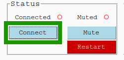

# Application contrôleur DCS5

Cette application python (python 3.10) fournit une interface graphique (GUI) pour interagir
avec une planche de mesure BigFin Dcs5 XT ou MICRO via Bluetooth.
L'application transforme les entrées de stylet sur la planche de mesure en saisie de clavier,
transformant essentiellement la planche de mesure en un clavier sans fil.
Il est également possible de connecter une balance Marel Marine à l'application.
Voir le projet [marel_marine_scale_controller](https://github.com/iml-gddaiss/marel_marine_scale_controller) pour plus d'informations sur comment configurer et utiliser la balance.

# Téléchargement de l'application

Télécharger la dernière version de l'application `Dcs5 Controller` via :

1.  Téléchargez la dernière vesion`dcs5-windows.zip` depuis la dernière version [ici](https://github.com/iml-gddaiss/dcs5/releases).
2.  Décompressez `dcs5-windows.zip`
3.  Lancez `dcs5.exe`


# Usage

## Planche de mesure

#### Zone de détection du stylet

Le stylet doit être placé à plat dans la zone de détection afin de prendre des mesures.
Le délai de détection est réglable dans la configuration (Voir la section [Fichiers de configuration](#fichiers-de-configuration)).

L'affichage de LED du boîtier de contrôle clignotent lorsqu'une mesure est effectuée.

<figure style="text-align: center;">

<figcaption>Zone de détection de la planche</figcaption>
</figure>

#### Modes de saisie

La planche de mesure dispose de 3 modes de saisie différents ; **Length**, **Top** et **Bottom**.
Les modes **Top** et **Bottom** sont utilisés
pour accéder aux touches du haut et du bas
en plaçant le stylet sur les cercles correspondants à l'intérieur de la zone de détection de la planche.
Le mode de saisie peut être change de 2 façons ;
en associant des commandes à des touches du boîtier de contrôle ou en définissant des régions de balayage sur la planche de mesure.

Des commandes peuvent être associées pour basculer vers un mode de sortie spécifique ou pour parcourir les modes de saisie.

-   Voir la section [Fichiers de configuration](#fichiers-de-configuration) pour les commandes de mode de saisie.

De plus, l'affichage de LED par défaut du boîtier de contrôle change en fonction des modes de saisie.

-   Voir la section [Affichages LED](#affichages-led).

#### Balayer la région

Glissez de la gauche vers la droite dans une zone de balayage changera le mode de saisie.
Les régions de balayage sont définies dans les fichiers de configuration.
Par exemple, voici les régions de balayage par défaut pour le modèle de boîtier de contrôle `xt`.

<figure style="text-align: center;">

<figcaption>Zone de balayage par défaut du modèle XT</figcaption>
</figure>

Les modes de saisie correspondants sont :

-   Gauche (Left), Droite (Right): **Longueur**
-   Bleu (Blue): **Haut**
-   Vert (Green): **Bas**

La définition des régions de balayage dans le fichier de configuration est :

```json
  {"output_modes": {
      "segments_limits": [0, 230, 430, 630, 800],
      "segments_mode": ["length", "top", "bottom", "length"]
      }}
```

-   Voir section [Spécification de la planchecation-de-lappareil) pour plus d'informations sur la définition des régions de balayage.

#### Exemple de mesure

Les mesures sont effectuées en plaçant la tête du stylet à plat dans la zone de détection de la planche.
Vous pouvez modifier les paramètres de mesures dans la [Configuration du contrôleur](#configuration-du-contrôleur).

<div style="text-align: center;">

</div>

## Boîtier de contrôle

Les seules différences notables entre les modèles de boîtier de contrôle `xt` et `micro` sont le nombre de touches et l'affichage LED et la séquence de clignotement.

### Modèle: `xt`

-   32 touches

<figure style="text-align: center;">

<figcaption>Boîtier de contrôle XT</figcaption>
</figure>

### Modèle: `miro`

-   3 touches

<figure style="text-align: center;">

<figcaption>Boîtier de contrôle MICRO</figcaption>
</figure>

### Affichages LED

Les boîtiers de contrôle utilisent différents affichages de DELs pour donner un retour aux utilisateurs.

-   XT : Barre de DELs `FUEL GAUGE / ACTION`
-   MICRO : Anneau de DELs

#### Mode de saisie

L'affichage par défaut indique le mode de saisie.

<figure style="text-align: center;">

<figcaption>Affichage de DELs du mode de saisie</figcaption>
</figure>

-   T : Haut
-   L : Longueur
-   B : Bas

#### Détection du stylet

L'affichage de DELs lorsque le stylet est détecté.

<figure style="text-align: center;">

<figcaption>Affichage de DELs lors de la détection du stylet</figcaption>
</figure>
 
#### Mesures

L'affichage de DELs clignotera rapidement lorsqu'une mesure est effectuée.

<figure style="text-align: center;">

<figcaption>Affichage de DELs lorsqu'une mesure est effectuée</figcaption>
</figure>

#### Balayage

<figure style="text-align: center;">

<figcaption>Affichage de DELs lors d'un balayage</figcaption>
</figure>

-   L : Balayage de droite à gauche
-   R : Balayage de gauche à droite

#### Étalonnage

En mode d'étalonnage, l'affichage par défaut devient :

<figure style="text-align: center;">

<figcaption>Affichage de DELs en mode d'étalonnage</figcaption>
</figure>

Une fois le stylet déposé, les DELs s'allumeront séquentiellement.
Lorsque qu'un point est calibré avec succès, l'ensemble des DELs clignoteront rapidement.

<figure style="text-align: center;">

<figcaption>Affichage de DELs lors de l'étalonnage</figcaption>
</figure>

## Application

### Configurations

L'application nécessite une configuration pour fonctionner.
Pour charger et modifier les configurations, cliquez sur **Dcs5 > Configuration** dans la barre du haut.

<figure style="text-align: center;">

<figcaption>Barre du haut de l'application</figcaption>
</figure>

À partir de la fenêtre *Configuration*, vous pouvez créer (**New**), charger (**Load**), supprimer (**Delete**) et modifier (**Edit**) les configurations.

<figure style="text-align: center;">

<figcaption>Fenêtre de Configurations</figcaption>
</figure>

#### Nouvelle configuration

Des configurations par défaut sont fournies pour les modèles **xt** et **micro**.
Sélectionnez le modèle de boîtier de contrôle (XT ou MICRO) et saisissez un nom pour la nouvelle configuration.

<figure style="text-align: center;">

<figcaption>Fenêtre de nouvelles Configurations</figcaption>
</figure>

L'adresse Bluetooth du contrôleur (adresse MAC) devra être changée une fois qu'une nouvelle configuration est créée.
Sélectionnez la configuration et le fichier `Controller Configuration` puis appuyer sur le bouton **Edit**.
Dans le fichier json, modifiez la valeur suivante :

-   `client -> mac_address`

Voir la section [Fichiers de configuration](#fichiers-de-configuration) pour plus d'informations sur les différents paramètres de configuration.

### Connectez la planche via Bluetooth

Pour se connecter à la planche de mesure Dcs5, l'adresse Mac (bluetooth) de la planche doit être spécifiée dans la Configuration du contrôleur.
Vous pouvez modifier le fichier via le menu de configuration (voir les sections [Configurations](#configurations) et [Configuration du contrôleur](#configuration-du-contrôleur))

Ensuite, vous devez connecter la planche puis activer l'application en appuyant sur le bouton **Connect** et ensuite sur le bouton **Activate**.

<figure style="text-align: center;">

<figcaption>Widget Connect</figcaption>
</figure>

Le cercle rouge à côté du bouton **Connect** se transformera en triangle jaune
lorsque l'application tente de se connecter à la planche, puis en un cercle vert lorsqu'elle est connectée.

<figure style="text-align: center;">

<figcaption>Widget Activate</figcaption>
</figure>

Le cercle rouge à côté du bouton **Activate** deviendra également vert lorsque l'application et la planche seront prêtes à être utilisées.
Lors de l'activation de la planche, l'application se synchronisera avec le boîtier de contrôle de la planche.
(Voir la section [Informations Supplémentaires](#informations-supplémentaires)).
L'application et la planche sont synchronisées
lorsque l'application reçoit les confirmations que les paramètres internes de la planche
(principalement ceux liés à la détection du stylet) sont les mêmes que ceux spécifiés dans la configuration.
Si la synchronisation échoue (indiqué par un cercle rouge à côté du bouton **Synchronize**)
vous pouvez appuyer sur le bouton **Synchronize** pour réessayer.
Si cela ne fonctionne toujours pas, essayez de redémarrer la planche et l'application.

### Étalonnage

La planche doit être étalonnée à partir de deux points de référence.
Bien que l'étalonnage soit linéaire, gardez en tête que le stylet a une épaisseur non uniforme qui compensera,
dans une certaine mesure, les valeurs mesurées si l'orientation du stylet diffère lors de la mesure par rapport à l'étalonnage.
Nous vous recommandons d'utiliser la plus petite partie du stylet pour effectuer l'étalonnage puis ajouter décalage `offset` dans la configuration pour chaque stylet.

-   Voir la section [Spécification de la planche](#spécification-de-la-planche).

Pour étalonner la planche, cliquez sur le bouton **Set Cal. Pts.**

<figure style="text-align: center;">

<figcaption>Widget Calibration</figcaption>
</figure>

Dans la fenêtre des points d'étalonnage, définissez les deux points d'étalonnage en mm.

<figure style="text-align: center;">

<figcaption>Fenêtre de Calibration</figcaption>
</figure>

Appuyez sur le bouton **Calibrate** pour entrer en mode étalonnage, puis suivez les instructions données par l'application.
Notez qu'un balayage de droite à gauche permet de quitter le mode d'étalonnage.
Pour chaque point d'étalonnage,
la progression de l'étalonnage sera indiquée par [l'affichage DELs](#calibration) une fois le stylet déposé.
Si le stylet est trop levé ou déplacé avant que l'étalonnage ne soit terminé, l'étalonnage du point recommence.

### Informations Supplémentaires.

#### Onglet DCS5

<figure style="text-align: center;">

<figcaption>Onglet Dcs5</figcaption>
</figure>

#### Onglet Échelle Marel

<figure style="text-align: center;">

<figcaption>Onglet Marel</figcaption>
</figure>

## Fichiers de configuration

Les configurations sont créées et modifiées via l'interface graphique de l'application (voir la section [configuration](#configurations)).
Une configuration est composée de deux fichiers json qui sont utilisés pour modifier le comportement du contrôleur et de la planche de mesure.

-   [configuration du contrôleur](#configurations)
-   [Spécification de la planche](#spécification-de-la-planche)

### Configuration du contrôleur

Fichier `xt` par défaut : [xt_controller_configuration.json](dcs5/default_configs/xt_controller_configuration.json)

Fichier `micro` par défaut : [micro_controller_configuration.json](dcs5/default_configs/micro_controller_configuration.json)

Usage:

-   client: Paramètres de connections.

    ```json
      {"client": {
          "device_name": "BigFinDCS5-E5FE",
          "mac_address": "00:06:66:89:E5:FE",
          "marel_ip_address": "192.168.0.202"
      }}
    ```

    -   device_name : Nom de la planche. (Uniquement utilisé pour afficher dans l'application).
    -   mac_address : Adresse Bluetooth (mac) de la planche de mesure, c'est-à-dire **00:06:66:89:E5:FE**.
    -   marel_ip_address : Adresse IP de la balance Marel (voir [marel_marine_scale_controller](https://github.com/iml-gddaiss/marel_marine_scale_controller)).

-   launch_settings : Paramètres utilisés au lancement de l'application.

    ```json
          {"launch_settings": {
          "output_mode": "length",
          "reading_profile": "measure",
          "dynamic_stylus_mode": true,
          "backlighting_level": 95,
          "length_units": "mm",
          "stylus": "pen",
          "auto_enter": true
          }}
    ```

    -   output_mode : length(longueur), top(haut) ou bottom(bas).
    -   reading_profile : Nom (clé) du profil. Les profils de lecture sont définis plus bas.
    -   dynamic_stylus_mode : (true/false) Si vrai(true), les profils de lecture changeront pour chaque mode de saisie.
    -   backlight_level : (0-95) Intensité du rétroéclairage
    -   length_units : Unités des valeurs de mesure soit **cm** ou **mm**
    -   stylet : Nom du stylet utilisé. Doit être défini dans le fichier de configuration [device_specifications](#device-specification).
    -   auto_enter : Appuie automatiquement sur la touche *enter* après avoir imprimé (à la position du curseur) d'une valeur de longueur ou de poids.

-   profiles de saisie :

    ```json
      {"reading_profiles": {
          "measure": {
              "settling_delay": 9,
              "number_of_reading": 50,
              "max_deviation": 50
          }}}
    ```

    -   settling_delay : (0-20) Délai après la première détection du stylet (pas en secondes).
    -   number_of_reading : Nombre de lectures nécessaires pour une bonne mesure.
    -   max_deviation : (1-100) Écart permis entre chaque lecture. Pour plus d'informations :[Big-Fin-Scientific-Fish-Board-Integration-Guide-V2_0.pdf](doc/Big-Fin-Scientific-Fish-Board-Integration-Guide-V2_0.pdf)_

-   modes de saisie :

    ```json
      {"output_modes": {
          "swipe_threshold": 5,
          "segments_limits": [0, 230, 430, 630, 800],
          "segments_mode": ["length", "top", "bottom", "length"],
          "mode_reading_profiles": {
              "top": "key",
              "length": "measure",
              "bottom": "key"
          }
    }}
    ```

    -   swipe_threshold : Distance minimale (mm) pour qu'un balayage de stylet soit valide.
    -   segments_limits : Définit les limites (mm) des différents segments de balayage.
    -   segments_mode : Le mode de saisie correspondant pour chaque segment de balayage.
    -   mode_reading_profiles : Les profils de lecture correspondants pour chaque mode de saisie.

-   keys_maps (voir la section [Associations des clés](#kassociations-mapping)):

    Des champs:`control_box`,`control_box_mode`,`board`,`board_mode`

    -   Une touche peut être associée à des commandes ou à des entrées au clavier.
    -   Une planche peut être une liste de commandes ou d'entrées au clavier qui sont exécutées une par une.
    -   Une touche peut avoir deux mappages : un par défaut et un mappage alternatif (mode).

#### Associations des clés

Les noms des clés sont définis dans [devices_specification.json](dcs5/default_configs/xt_devices_specification.json).

Commandes :

-   `"BACKLIGHT_UP", "BACKLIGHT_DOWN"`: Modifier le niveau de rétroéclairage du boîtier de contrôle.
-   `"CHANGE_STYLUS"`: Parcourir la liste des stylets définis dans le fichier [device_specifications](#device-specification)déposer.
-   `"UNITS_mm", "UNITS_cm"`: Modifier les unités de saisie.
-   `"MODE_TOP", "MODE_LENGTH", "MODE_BOTTOM"`: Changez le mode de saisie.
-   `"CHANGE_OUTPUT_MODE"`: Faire défiler le mode de saisie (TOP, LENGTH, BOTTOM).
-   `"MODE"`: Accéder au mappage (mode) alternatif (`control_box_mode`,`board_mode`).
-   `"WEIGHT"`: Imprime le poids mesuré par la balance Marel (si connectée).
-   `"DELETE_LAST`: Supprimer la dernière valeur imprimée.
-   `"PRINT <string to print>"]`: Imprime le`<string to print>`valeur.
    Saisie valide au clavier (Source : [Pya Uto manger](https://pyautogui.readthedocs.io/en/latest/)):
    ```python
    ['\t', '\n', '\r', ' ', '!', '"', '#', '$', '%', '&', "'",
    '(', ')', '*', '+', ',', '-', '.', '/', '{', '|', '}', '~',
    ':', ';', '<', '=', '>', '?', '@', '[', '\\', ']', '^', '_', '`',
    '0', '1', '2', '3', '4', '5', '6', '7', '8', '9',
    'a', 'b', 'c', 'd', 'e', 'f', 'g', 'h', 'i', 'j', 'k', 'l', 'm', 'n', 'o',
    'p', 'q', 'r', 's', 't', 'u', 'v', 'w', 'x', 'y', 'z',
    'A', 'B', 'C', 'D', 'E', 'F', 'G', 'H', 'I', 'J', 'K', 'L', 'M', 'N', 'O',
    'P', 'Q', 'R', 'S', 'T', 'U', 'V', 'W', 'X', 'Y', 'Z'
    'accept', 'add', 'alt', 'altleft', 'altright', 'apps', 'backspace',
    'browserback', 'browserfavorites', 'browserforward', 'browserhome',
    'browserrefresh', 'browsersearch', 'browserstop', 'capslock', 'clear',
    'convert', 'ctrl', 'ctrlleft', 'ctrlright', 'decimal', 'del', 'delete',
    'divide', 'down', 'end', 'enter', 'esc', 'escape', 'execute', 'f1', 'f10',
    'f11', 'f12', 'f13', 'f14', 'f15', 'f16', 'f17', 'f18', 'f19', 'f2', 'f20',
    'f21', 'f22', 'f23', 'f24', 'f3', 'f4', 'f5', 'f6', 'f7', 'f8', 'f9',
    'final', 'fn', 'hanguel', 'hangul', 'hanja', 'help', 'home', 'insert', 'junja',
    'kana', 'kanji', 'launchapp1', 'launchapp2', 'launchmail',
    'launchmediaselect', 'left', 'modechange', 'multiply', 'nexttrack',
    'nonconvert', 'num0', 'num1', 'num2', 'num3', 'num4', 'num5', 'num6',
    'num7', 'num8', 'num9', 'numlock', 'pagedown', 'pageup', 'pause', 'pgdn',
    'pgup', 'playpause', 'prevtrack', 'print', 'printscreen', 'prntscrn',
    'prtsc', 'prtscr', 'return', 'right', 'scrolllock', 'select', 'separator',
    'shift', 'shiftleft', 'shiftright', 'sleep', 'space', 'stop', 'subtract', 'tab',
    'up', 'volumedown', 'volumemute', 'volumeup', 'win', 'winleft', 'winright', 'yen',
    'command', 'option', 'optionleft', 'optionright']
    ```

### Spécification de la planche

Fichier par défaut : [devices_specification.json](dcs5/default_configs/xt_devices_specification.json)

Usage:

-   conseil:

    ```json
     {"board": {
              "number_of_keys": 49,
              "key_to_mm_ratio": 15.385,
              "zero": -3.695,
              "detection_range": 2}
    }
    ```

    -   number_of_keys : les clés correspondent au cercle gris sur le tableau.
    -   key_to_mm_ratio : La distance en mm d'un bord d'un cercle (le plus grand) au suivant.
    -   zéro : La distance (mm) qui serait la touche 0 étant donné que la première touche du tableau est la touche 1.
    -   detection_range : Décalage à gauche en mm pour la détection du stylet.
    -   keys_layout : listes ordonnées pour le nom des touches du haut et pour les touches du bas. Ces noms sont utilisés pour mapper la commande.
        -   Haut:
        -   Bas:

    _Remarques : Les deux listes (haut et bas) ne doivent pas contenir de noms identiques.
-   boîtier de contrôle:
    -   modèle : Modèle du boîtier de contrôle. Soit **xt** ou **micro**.
    -   keys_layout : Mappage de l'identifiant intégré de la clé de la boîte de contrôleur sur un nom significatif. Ces noms sont utilisés pour mapper la commande.
-   stylus_offset : décalage en mm qui s'ajoute à la valeur mesurée par la planche.
    -   Remarque : Ces valeurs dépendent de l'étalonnage.
