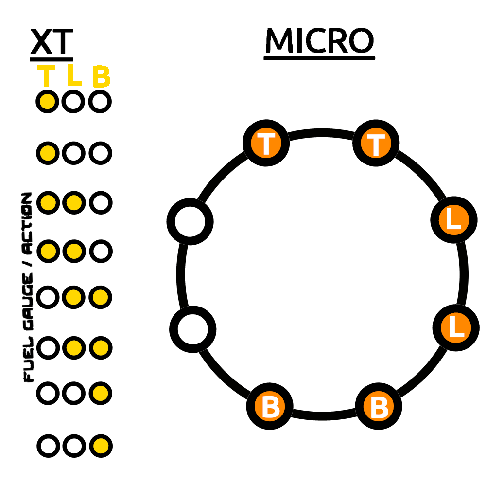
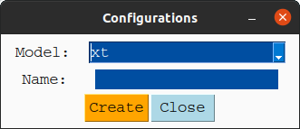
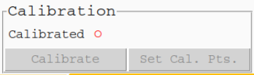
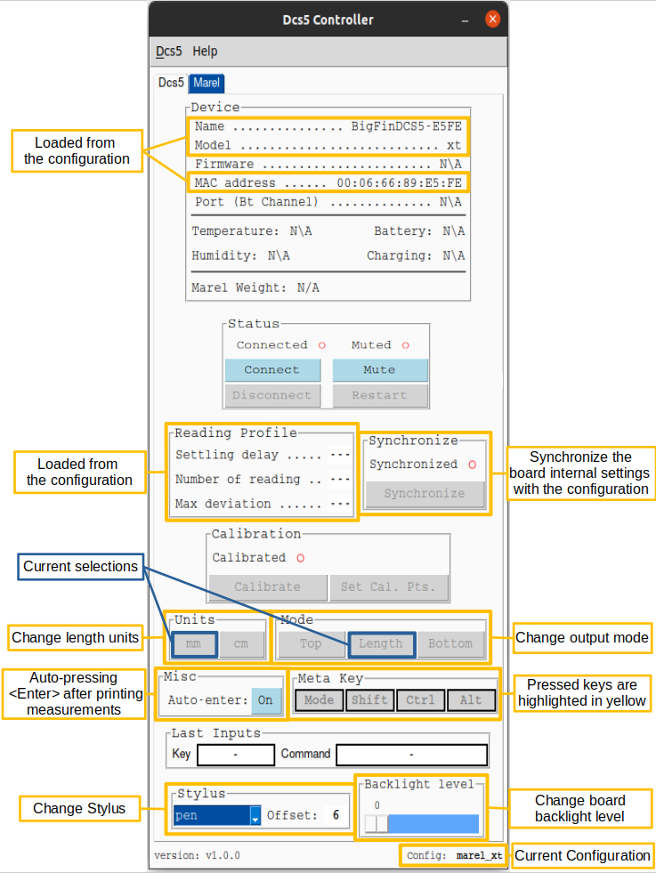

# Dcs5 Controller Application

This python (python 3.10) application provides a graphical interface to interact
(GUI) with a BigFin Dcs5 XT or MICRO measuring board via Bluetooth.
The application turns stylus inputs on the measuring board into keyboard entry,
essentially turning the dcs5 measuring board into a wireless keyboard.
A Marel Marine Scale can also be connected to the application. 
See the project [marel_marine_scale_controller](https://github.com/iml-gddaiss/marel_marine_scale_controller) for more information and how to set up the scale.

# Download from releases
Downloading the Dcs5 Controller App from the latest release.

1. Download `dcs5.zip` from the last version [here](https://github.com/iml-gddaiss/dcs5/releases).
2. Unzip `dcs5.zip`
3. Run `dcs5.exe`


## Requirements to install the python package. (Not required to use the app as a standalone.)
- python 3.10

# Usage
### Guide d'utilisation en français pour le modèle XT : [UserGuide_fr.pdf](doc/UserGuide_fr.pdf).

## Measuring Board

#### Stylus detection zone
The stylus needs to be placed within the detection zone.
The detection delay can be adjusted in the configuration (See section [Configuration files](#configurations-files)).
The control box lights will flash when a measurement is made.

<figure style="text-align: center;">

<figcaption>Board Detection Zone </figcaption>
</figure>

#### Output modes

The measurement board has 3 different output modes; **length**, **top** and **bottom**. 
The **top** and **bottom** mode are used
to access the top and bottom keys
by placing the stylus on the corresponding circle within the detection zone of the board.
There are 2 ways to change the detection zone;
by mapping commands to the control box keys or by defining swiping regions on the board.

The map command to change to a specific output mode or to cycle through the output modes.
* See section [Configuration files](#configurations-files) for the output mode commands.


Furthermore, the default LED display of the control box changes depending on the output modes.
* See section [LEDs Displays](#leds-displays).

#### Swiping Region

Starting left to right in a swiping zone will change the output mode.
The swiping regions are defined in the configuration files.
For example, here are the defaults swiping regions for the `xt` control box.
<figure style="text-align: center;">

<figcaption>Default XT Swipe Zone </figcaption>
</figure>
The corresponding output modes are:

* Left, Right : **Length**
* Blue : **Top**
* Green: **Bottom**

The map definition in the configuration file is:

  ```json
    {"output_modes": {
        "segments_limits": [0, 230, 430, 630, 800],
        "segments_mode": ["length", "top", "bottom", "length"]
        }}
  ```

* See section [Device Specification](#device-specification) for information on how to define the swiping region. 


#### Measurement example
Measurements are made by placing the stylus head flat on the board within the detection zone.
You can change the measurement/detection settings in the [controller_configuration](#controller-configuration).
<div style="text-align: center;">

</div>


## Control Box


The only difference between the `xt` and `micro` control box models are the number of keys and the LED display and flash sequence.

### Model: `xt`
* 32 keys

<figure style="text-align: center;">

<figcaption>Xt Control Box</figcaption>
</figure>


### Model: `miro`

* 3 keys

<figure style="text-align: center;">

<figcaption>Micro Control Box</figcaption>
</figure>


### LEDs Displays
Different LEDs patterns are displayed on the control box to give feedback to the users.

* xt: FUEL GAUGE / ACTION led bar
* micro: Led Ring

#### Output mode
The default pattern displays the current output mode.
<figure style="text-align: center;">

<figcaption>Output Mode LED Display</figcaption>
</figure>

* T: Top 
* L: Length
* B: Bottom

#### Stylus detection
The follow led pattern is displayed when the board detects the stylus.
<figure style="text-align: center;">

<figcaption>Stylus Detection LED Display</figcaption>
</figure>
 
#### Measurements
All the leds flash rapidly when a measurement is made.
The default pattern displays the current output mode.
<figure style="text-align: center;">

<figcaption>Measurement LED Display</figcaption>
</figure>

#### Swipe

<figure style="text-align: center;">

<figcaption>Swipe LED Display</figcaption>
</figure>

* L: Right to Left swipe
* R: Left to Right swipe

#### Calibration
In calibration mode, the default display changes to
<figure style="text-align: center;">

<figcaption>Calibration Mode LED Display</figcaption>
</figure>

Then, once the stylus is placed down, the leds will slowly light up in the following sequences.
When the point is successfully calibrated is over, all the leds will rapidly flash.

<figure style="text-align: center;">

<figcaption>Calibration LED Display</figcaption>
</figure>


## Application

### Configurations

The application requires a configuration to work.
To load and manage configuration, click on **Dcs5 > Configuration** in the top bar. 

<figure style="text-align: center;">

<figcaption>Application Menu Widget</figcaption>
</figure>

From the *Configuration* window, you can create **New**, **Load**, **Delete** and **Edit** configurations.
<figure style="text-align: center;">

<figcaption>Config Window</figcaption>
</figure>

#### New configuration
Default configurations are provided for the `xt` and `micro` models.
Select the Control Box model (xt or micro) and enter a name for the new configuration.
<figure style="text-align: center;">

<figcaption>New Config Window</figcaption>
</figure>

The bluetooth address of the controller (mac address) will need to be changed once a new configuration is created.
Select the configuration and the `Controller Configuration` file and press **Edit**.
In the json file, change the following value:

* ```client -> mac_address```


See section [Configuration files](#configurations-files) for more information on the different configuration parameters.

### Connect the board via Bluetooth

To connect to the Dcs5 measuring board, the Board Mac (bluetooth) address needs to be specified in the *Controller Configuration* file. You can edit the file via the configuration menu (see sections [Configurations](#configurations) and [Controller Configuration](#controller-configuration)) 


Then you need to connect and then activate the board by pressing the **Connect** and **Activate** button. 

<figure style="text-align: center;">

<figcaption>Connect Widget</figcaption>
</figure>

The red circle next to the **Connect** button will turn into a yellow triangle
while the application is attempting to connect to the board and then into a green when connected.

<figure style="text-align: center;">

<figcaption>Activate Widget</figcaption>
</figure>

The red circles next to the **Activate** button will also turn green when the application and board are ready to use.
When activating the board, the application will synchronize with the board control box.
(See the section [Additional GUI features](#additional-information)).
The application will try to synchronize with the board control box on activation.
The application and the board are synchronized
when the application receives confirmations that the board internal parameters
(mainly those related to stylus detection) are the same as those specified in the configuration files. 
If the synchronization failed, indicated by a red circle next to the **Synchronize** button,
you can press the **Synchronize** button to try again.
If it still doesn't work, try to restart the board and the application.


### Calibration

The board needs to be calibrated using two calibration points. 
Although the calibration is linear, keep in mind that the stylus has some non-uniform thickness which will offset,
to some extent, the measured values if the stylus's orientation differs when measuring versus when calibrating. 
We recommend using the tiniest part of the stylus to make the calibration
and then add `offset` in the calibration files for each stylus.

* See section [Device Specification](#device-specification). 

To calibrate the board, click on **Set Cal. Pts.**

<figure style="text-align: center;">

<figcaption>Calibration Widget</figcaption>
</figure>

In the calibration points window set the two calibration points in mm.
<figure style="text-align: center;">

<figcaption>Calibration Set. Cal. Pts. Window</figcaption>
</figure>


Press the **Calibrate** button to enter the calibration mode,
from there follow the instruction given by the application.
Note that a right to left swipe will exit the calibration mode.
For each calibration point,
the calibration progress will be shown by the following LEDs [display](#calibration) once the stylus is placed down. 
If the stylus is lifted or moved too much before the calibration is done, the calibration restart. 


### Additional information.

#### Dcs5 Tab
<figure style="text-align: center;">

<figcaption>Application Window</figcaption>
</figure>

#### Marel Scale Tab
<figure style="text-align: center;">

<figcaption>Application Marel Widget</figcaption>
</figure>


## Configurations Files

Configurations are created and modified via the application GUI (See section [configuration](#configurations)). 
A configuration is made of two json files that are used to change the controller and measuring board behavior. 
- [controller_configuration](#controller-configuration)
- [device_specification](#device-specification)

### Controller Configuration
Default `xt` file: [xt_controller_configuration.json](dcs5/default_configs/xt_controller_configuration.json)

Default `micro` file:  [micro_controller_configuration.json](dcs5/default_configs/micro_controller_configuration.json)


Usage:

+ client: Measuring board bluetooth information.

  ```json
    {"client": {
        "device_name": "BigFinDCS5-E5FE",
        "mac_address": "00:06:66:89:E5:FE",
        "marel_ip_address": "192.168.0.202"
    }}
  ``` 
  
  - device_name: Name of the device. (Only used to display in the app.)
  - mac_address: Bluetooth (mac) address of the measuring board i.e. **00:06:66:89:E5:FE**.
  - marel_ip_address: Ip address of the Marel Scale (see [marel_marine_scale_controller](https://github.com/iml-gddaiss/marel_marine_scale_controller)).
+ launch_settings: setting used when the app is launched.

  ```json
        {"launch_settings": {
        "output_mode": "length",
        "reading_profile": "measure",
        "dynamic_stylus_mode": true,
        "backlighting_level": 95,
        "length_units": "mm",
        "stylus": "pen",
        "auto_enter": true
        }}
  ```
  
  - output_mode: top, length or bottom.
  - reading_profile: Name (key) of the profile. The reading profiles are defined below.
  - dynamic_stylus_mode: (true/false) If true, reading profiles will change for each output mode as defined in the next section.
  - backlight_level: (0-95) Backlight intensity
  - length_units: Units of the measurements values either **cm** or **mm**
  - stylus: Name of the stylus in use. Must be defined in the [devices_specifications](#device-specification) file. 
  - auto_enter: Automatically press the *enter* key after a length or weight value is printed.
  
+ reading_profiles:

  ```json
    {"reading_profiles": {
        "measure": {
            "settling_delay": 9,
            "number_of_reading": 50,
            "max_deviation": 50
        }}}
  ```
  
  - settling_delay: (0-20) Delays after the stylus is first detected. (not seconds)
  - number_of_reading: Number of readings needed for a good measurements.
  - max_deviation: (1-100) Amount of deviation allowed between each reading.
  *Notes: For more information : [user_guide/Big-Fin-Scientific-Fish-Board-Integration-Guide-V2_0.pdf](doc/Big-Fin-Scientific-Fish-Board-Integration-Guide-V2_0.pdf)*

+ output_modes:

  ```json
    {"output_modes": {
        "swipe_threshold": 5,
        "segments_limits": [0, 230, 430, 630, 800],
        "segments_mode": ["length", "top", "bottom", "length"],
        "mode_reading_profiles": {
            "top": "key",
            "length": "measure",
            "bottom": "key"
        }
  }}
  ```
  
  - swipe_threshold: Minimal distance (mm) for a stylus swipe to be valid.
  - segments_limits: Define the boundaries (mm) of the different swipe segments.
  - segments_mode: The corresponding output_mode for each swipe segment.
  - mode_reading_profiles: The corresponding reading_profiles for each output mode.
+ keys_maps (See [Key Mapping](#key-mapping) section): 

  Fields: `control_box`, `control_box_mode`, `board`, `board_mode`

  - A key can be mapped to commands or keyboard inputs.
  - A map can be a list of commands or keyboard inputs which are executed one at a time.
  - A key can have two mappings: One default and when the alternative (mode) mapping. 
  

#### Key Mapping
  The names of the keys are set in [devices_specification.json](dcs5/default_configs/xt_devices_specification.json).
  
  Commands:

  + `"BACKLIGHT_UP", "BACKLIGHT_DOWN"`: Change the control box backlight level.
  + `"CHANGE_STYLUS"`: Cycle through the list of stylus defined in the [devices_specifications](#device-specification) file. 
  + `"UNITS_mm", "UNITS_cm"`: Change output units.
  + `"MODE_TOP", "MODE_LENGTH", "MODE_BOTTOM"`: Change the output mode.
  + `"CHANGE_OUTPUT_MODE"`: Cycle through output mode (TOP, LENGTH, BOTTOM).
  + `"MODE"`: Access the alternative (mode) mapping (`control_box_mode`, `board_mode`).
  + `"WEIGHT"`: Prints the weight measured by the Marel Scale (if connected).
  + `"DELETE_LAST`: Delete the last printed value.
  + `"PRINT <string to print>"`: Prints the `<string to print>` value. e.g. "PRINT This Will be Printed" 
  
  Valid keyboard input (Source: [PyAutoGui](https://pyautogui.readthedocs.io/en/latest/)):
    
  ```python
['\t', '\n', '\r', ' ', '!', '"', '#', '$', '%', '&', "'",
  '(', ')', '*', '+', ',', '-', '.', '/', '{', '|', '}', '~',
  ':', ';', '<', '=', '>', '?', '@', '[', '\\', ']', '^', '_', '`',
  '0', '1', '2', '3', '4', '5', '6', '7', '8', '9',
  'a', 'b', 'c', 'd', 'e', 'f', 'g', 'h', 'i', 'j', 'k', 'l', 'm', 'n', 'o',
  'p', 'q', 'r', 's', 't', 'u', 'v', 'w', 'x', 'y', 'z',
  'A', 'B', 'C', 'D', 'E', 'F', 'G', 'H', 'I', 'J', 'K', 'L', 'M', 'N', 'O',
  'P', 'Q', 'R', 'S', 'T', 'U', 'V', 'W', 'X', 'Y', 'Z'
  'accept', 'add', 'alt', 'altleft', 'altright', 'apps', 'backspace',
  'browserback', 'browserfavorites', 'browserforward', 'browserhome',
  'browserrefresh', 'browsersearch', 'browserstop', 'capslock', 'clear',
  'convert', 'ctrl', 'ctrlleft', 'ctrlright', 'decimal', 'del', 'delete',
  'divide', 'down', 'end', 'enter', 'esc', 'escape', 'execute', 'f1', 'f10',
  'f11', 'f12', 'f13', 'f14', 'f15', 'f16', 'f17', 'f18', 'f19', 'f2', 'f20',
  'f21', 'f22', 'f23', 'f24', 'f3', 'f4', 'f5', 'f6', 'f7', 'f8', 'f9',
  'final', 'fn', 'hanguel', 'hangul', 'hanja', 'help', 'home', 'insert', 'junja',
  'kana', 'kanji', 'launchapp1', 'launchapp2', 'launchmail',
  'launchmediaselect', 'left', 'modechange', 'multiply', 'nexttrack',
  'nonconvert', 'num0', 'num1', 'num2', 'num3', 'num4', 'num5', 'num6',
  'num7', 'num8', 'num9', 'numlock', 'pagedown', 'pageup', 'pause', 'pgdn',
  'pgup', 'playpause', 'prevtrack', 'print', 'printscreen', 'prntscrn',
  'prtsc', 'prtscr', 'return', 'right', 'scrolllock', 'select', 'separator',
  'shift', 'shiftleft', 'shiftright', 'sleep', 'space', 'stop', 'subtract', 'tab',
  'up', 'volumedown', 'volumemute', 'volumeup', 'win', 'winleft', 'winright', 'yen',
  'command', 'option', 'optionleft', 'optionright']
  ```

### Device Specification
Default file: [devices_specification.json](dcs5/default_configs/xt_devices_specification.json)

Usage:

+ board:

  ```json
   {"board": {
            "number_of_keys": 49,
            "key_to_mm_ratio": 15.385,
            "zero": -3.695,
            "detection_range": 2}
  }
  ```
  
  - number_of_keys: The keys correspond to the grey circle on the board.
  - key_to_mm_ratio: The distance in mm from one edge of a circle (larger one) to the next.
  - zero: The distance (mm) that would be the key 0 given that the first key on the board is key 1.
  - detection_range: Offset on the left in mm for stylus detection. 
  - keys_layout: Ordered lists for the name of the top keys and the for the bottom keys. These names are used to map command.
    * Top:
    * Bottom: 
  
  *Notes: The two lists (top and bottom) should not contain identical names.*
+ control_box:
  - model: Model of the control box. Either **xt** or **micro**.
  - keys_layout: Mapping of the controller box key builtin id to meaningful name. These names are used to map command. 
+ stylus_offset: Offset in mm that is added to the value measured by the board. 
  - Note: These values will depend on the calibration.
