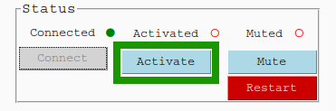

# Dcs5 Controller app

This python (python 3.10) application provides graphical interface to interact (GUI) with a BigFin Dcs5 XT or MICRO measuring board via Bluetooth.
The application turn stylus inputs on the measuring board into keyboard entry, essentially turning the dcs5 measuring board into a wireless keyboard.
A Marel Marine Scale can also be connected to the application. 
See the project [marel_marine_scale_controller](https://github.com/iml-gddaiss/marel_marine_scale_controller) for more information and how to set up the scale.

# Download from releases
Downloading the Dcs5 Controller App from the latest release.
1. Download `dcs5.zip` from the last version here: https://github.com/iml-gddaiss/dcs5/releases.
2. Unzip `dcs5.zip`
3. Run `dcs5.exe`


## Requirements to install the python package. (not required to use the app as a standalone.)
- python 3.10

# Usage
### Guide d'utilisation en français pour le modèle XT : [UserGuide_fr.pdf](doc/UserGuide_fr.pdf).

## Measuring Board

The only difference between the `xt` and `micro` control box models are the number of keys (xt: 32, micro: 3) and the lights 
display and flash sequence.

#### Stylus detection zone
The stylus needs to be place within the detection zone.
The detection delay can be adjusted in the configuration (See section [Configuration files](#configurations-files)).
The control box lights will flash when a measurement is made.

<p align='center'>

</p>

#### Swiping zone

The measurement board has 3 different output mode; length, top keys and bottom keys.
When in top or bottom keys mode, the stylus needs to be place on the circle within the detection zone of the board.
There is 2 ways to change the detection zone; by mapping commands to the control box keys or by defining swiping region on the board.
The control box will display a different lights pattern for each outputs modes.
See section [Configuration files](#configurations-files) for the output mode commands.
Swiping from left to right in the swiping zone defined in the configuration will change the output mode: *Top*, *Length* and *Bottom*.
See section [Device Specification](#device-specification) for information on how to define the swiping region. 

<p align='center'>

</p>

In the figure above are the default swiping zone for the *xt* models.
From left to right they are map to outputs mode *Length*, *Top*, *Bottom* and *Length*.

#### Measurement example
<p align='center'>

</p>


## GUI

### Configurations

To load and manage configuration click on **Dcs5 > Configuration** in the top bar. 
<p align='center'>

</p>

From the *Configuration* window, you can create **New**, **Load**, **Delete** and **Edit** configurations.
See section [Configuration files](#configurations-files) for more information on the different configurations parameters.
<p align='center'>

</p>

#### New configuration
Select the Control Box model (xt or micro) and enter name for the new configuration.
<p align='center'>

</p>

### Connect the board via Bluetooth

To connect to the Dcs5 measuring board, the Board Mac (bluetooth) address needs to be specified in the *Controller Configuration* file. You can edit the file via the configuration menu (see sections [Configurations](#configurations) and [Controller Configuration](#controller-configuration)) 


Then you need to connect and activate the board by pressing the **Connect** and **Activate** button. 

<p align='center'>

</p>

The red circle will turn into a yellow triangle while the App is attempting to connect to the board and then green when connected.

<p align='center'>

</p>

The activated red circles will also turn green when the application and board are ready to use.
When activating the board, the application will synchronize with the board control box. (See the section [Additionnal GUI features](#additional-gui-features)). 
The application and board are synchronize when the application successfully changed the board control box settings to those specified in the configuration.


### Calibration

Click on *Set Cal. Pts.* 

<p align='center'>

</p>

In the calibration points window set the two calibrations points in mm.
After the calibration is done, you can add offset if you use different stylus .
This is done in the [Device Specification](#device-specification) file (see section [Configurations](#configurations)).

<p align='center'>

</p>


### Additional informations.

#### Dcs5 Tab
<p align='center'>

</p>

#### Marel Scale Tab
<p align='center'>

</p>


## Configurations Files

Configurations are created and modified via the application GUI. A configuration is made of 
2 json files that are used to change the controller and measuring board behavior. 
- [controller_configuration](#controller-configuration)
- [device_specification](#device-specification)

### Controller Configuration
Default `xt` file: [xt_controller_configuration.json](dcs5/default_configs/xt_controller_configuration.json)

Default `micro` file:  [micro_controller_configuration.json](dcs5/default_configs/micro_controller_configuration.json)


Usage:
+ client: Measuring board bluetooth information.
  ```json
    "client": {
        "device_name": "BigFinDCS5-E5FE",
        "mac_address": "00:06:66:89:E5:FE",
        "marel_ip_address": "192.168.0.202"
    },
  ``` 
  - device_name: Name of the device. (Only use to display in the app.)
  - mac_address: Bluetooth (mac) address of the board i.e. **00:06:66:89:E5:FE**.
  - marel_ip_address: Ip address of the Marel Scale (see [marel_marine_scale_controller](https://github.com/iml-gddaiss/marel_marine_scale_controller)).
+ launch_settings: setting used when the app is launch.
  ```json
        "launch_settings": {
        "output_mode": "length",
        "reading_profile": "measure",
        "dynamic_stylus_mode": true,
        "backlighting_level": 95,
        "length_units": "mm",
        "stylus": "pen",
        "auto_enter": true
    }
  ```
  - output_mode: top, length or bottom.
  - reading_profile: Name (key) of the profile. The reading profiles are defined below.
  - dynamic_stylus_mode: (true/false) If true, reading profiles will change for each output mode as defined in the next section.
  - backlight_level: (0-95) Backlight intensity
  - length_units: Units of the measurements values either **cm** or **mm**
  - stylus: Name of the stylus in use. Must be defined in the [devices_specifications](#device-specification) file. 
  - auto_enter: Automatically press the *enter* key after a length or weight value is printed.
  
+ reading_profiles:
  ```json
    "reading_profiles": {
        "measure": {
            "settling_delay": 9,
            "number_of_reading": 50,
            "max_deviation": 50
        }
  ```
  - settling_delay: (0-20) Delays after the stylus is first detected. (not seconds)
  - number_of_reading: Number of reading needed for a good measurements.
  - max_deviation: (1-100) Amount of deviation allowed between each reading.
  *Notes: For more information : [user_guide/Big-Fin-Scientific-Fish-Board-Integration-Guide-V2_0.pdf](doc/Big-Fin-Scientific-Fish-Board-Integration-Guide-V2_0.pdf)*
+ output_modes:
  ```json
    "output_modes": {
        "swipe_threshold": 5,
        "segments_limits": [0, 230, 430, 630, 800],
        "segments_mode": ["length", "top", "bottom", "length"],
        "mode_reading_profiles": {
            "top": "key",
            "length": "measure",
            "bottom": "key"
        }
  }
  ```
  - swipe_threshold: Minimal distance (mm) for a stylus swipe to be valid.
  - segments_limits: Define the boundaries (mm) of the different swipe segments.
  - segments_mode: The corresponding output_mode for each swipe segment.
  - mode_reading_profiles: The corresponding reading_profiles for each output modes.
+ keys_maps (See [Key Mapping](#key-mapping-) section): 
  Fields: `control_box`, `control_box_mode`, `board`, `board_mode`
  - A key can be mapped to commands or keyboard inputs.
  - A map can be a list of commands or keyboard inputs which are executed one at a time.
  - A key can have two mapping: One default and when the alternative (mode) mapping. 
  

#### Key Mapping
  The name of the keys are set in [devices_specification.json](dcs5/default_configs/xt_devices_specification.json).
  
  Commands:
  + `"BACKLIGHT_UP", "BACKLIGHT_DOWN"`: Change the board backlight level.
  + `"CHANGE_STYLUS"`: Cycle throught the list of stylus define in the [devices_specifications](#device-specification) file. 
  + `"UNITS_mm", "UNITS_cm"`: Change output units.
  + `"MODE_TOP", "MODE_LENGTH", "MODE_BOTTOM"`: Change the output mode.
  + `"CHANGE_OUTPUT_MODE"`: Cycle through output mode (TOP, LENGHT, BOTTOM).
  + `"MODE"`: Access the alternative (mode) mapping (`control_box_mode`, `board_mode`).
  + `"WEIGHT"`: Prints the weight measured by the Marel Scale (if connected).
  + `"DELETE_LAST`: Delete the last printed value.
  + `"PRINT <string to print>"]`: Prints the `<string to print>` value.
  
  Valid keyboard input (Source: [PyAutoGui](https://pyautogui.readthedocs.io/en/latest/)):
    
  ```
  ['\t', '\n', '\r', ' ', '!', '"', '#', '$', '%', '&', "'",
  '(', ')', '*', '+', ',', '-', '.', '/', '{', '|', '}', '~',
  ':', ';', '<', '=', '>', '?', '@', '[', '\\', ']', '^', '_', '`',
  '0', '1', '2', '3', '4', '5', '6', '7', '8', '9',
  'a', 'b', 'c', 'd', 'e', 'f', 'g', 'h', 'i', 'j', 'k', 'l', 'm', 'n', 'o',
  'p', 'q', 'r', 's', 't', 'u', 'v', 'w', 'x', 'y', 'z',
  'A', 'B', 'C', 'D', 'E', 'F', 'G', 'H', 'I', 'J', 'K', 'L', 'M', 'N', 'O',
  'P', 'Q', 'R', 'S', 'T', 'U', 'V', 'W', 'X', 'Y', 'Z'
  'accept', 'add', 'alt', 'altleft', 'altright', 'apps', 'backspace',
  'browserback', 'browserfavorites', 'browserforward', 'browserhome',
  'browserrefresh', 'browsersearch', 'browserstop', 'capslock', 'clear',
  'convert', 'ctrl', 'ctrlleft', 'ctrlright', 'decimal', 'del', 'delete',
  'divide', 'down', 'end', 'enter', 'esc', 'escape', 'execute', 'f1', 'f10',
  'f11', 'f12', 'f13', 'f14', 'f15', 'f16', 'f17', 'f18', 'f19', 'f2', 'f20',
  'f21', 'f22', 'f23', 'f24', 'f3', 'f4', 'f5', 'f6', 'f7', 'f8', 'f9',
  'final', 'fn', 'hanguel', 'hangul', 'hanja', 'help', 'home', 'insert', 'junja',
  'kana', 'kanji', 'launchapp1', 'launchapp2', 'launchmail',
  'launchmediaselect', 'left', 'modechange', 'multiply', 'nexttrack',
  'nonconvert', 'num0', 'num1', 'num2', 'num3', 'num4', 'num5', 'num6',
  'num7', 'num8', 'num9', 'numlock', 'pagedown', 'pageup', 'pause', 'pgdn',
  'pgup', 'playpause', 'prevtrack', 'print', 'printscreen', 'prntscrn',
  'prtsc', 'prtscr', 'return', 'right', 'scrolllock', 'select', 'separator',
  'shift', 'shiftleft', 'shiftright', 'sleep', 'space', 'stop', 'subtract', 'tab',
  'up', 'volumedown', 'volumemute', 'volumeup', 'win', 'winleft', 'winright', 'yen',
  'command', 'option', 'optionleft', 'optionright']
  ```

### Device Specification
Default file: [devices_specification.json](dcs5/default_configs/xt_devices_specification.json)

Usage:
+ board:
  ```json
   "board": {
            "number_of_keys": 49,
            "key_to_mm_ratio": 15.385,
            "zero": -3.695,
            "detection_range": 2,
  ```
  - number_of_keys: The keys correspond to the grey circle on the board.
  - key_to_mm_ratio: The distance in mm from one edge of a circle (larger one) to the next.
  - zero: The distance (mm) that would be the key 0 given that the first key on the board is key 1.
  - detection_range: Offset on the left in mm for stylus detection. 
  - keys_layout: Ordered lists for the name of the top keys and the for the bottom keys. These names are used to map command.
    * Top:
    * Bottom: 
  
  *Notes: The two list (top and bottom) should not contain identical names.*
+ control_box:
  - model: Model of the control box. Either **xt** or **micro**.
  - keys_layout: Mapping of the controller box key builtin id to meaningful name. These names are used to map command. 
+ stylus_offset: Offset in mm that is added ot the value measured by the board. 
  - Notes: These values will depend on the calibration.

#### Mircro Control Box Keys:
<p align='center'>

</p>
